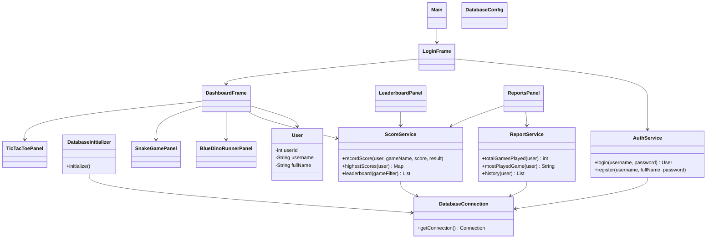

# Class Diagram

```mermaid
classDiagram
    class Main
    class User {
        -int userId
        -String username
        -String fullName
    }
    class DatabaseConfig
    class DatabaseConnection {
        +getConnection() Connection
    }
    class DatabaseInitializer {
        +initialize()
    }
    class AuthService {
        +login(username, password) User
        +register(username, fullName, password)
    }
    class ScoreService {
        +recordScore(user, gameName, score, result)
        +highestScores(user) Map
        +leaderboard(gameFilter) List
    }
    class ReportService {
        +totalGamesPlayed(user) int
        +mostPlayedGame(user) String
        +history(user) List
    }
    class LoginFrame
    class DashboardFrame
    class LeaderboardPanel
    class ReportsPanel
    class BlueDinoRunnerPanel
    class SnakeGamePanel
    class TicTacToePanel

    Main --> LoginFrame
    LoginFrame --> AuthService
    LoginFrame --> DashboardFrame
    DashboardFrame --> User
    DashboardFrame --> ScoreService
    DashboardFrame --> BlueDinoRunnerPanel
    DashboardFrame --> SnakeGamePanel
    DashboardFrame --> TicTacToePanel
    LeaderboardPanel --> ScoreService
    ReportsPanel --> ReportService
    ReportsPanel --> ScoreService
    AuthService --> DatabaseConnection
    ScoreService --> DatabaseConnection
    ReportService --> DatabaseConnection
    DatabaseInitializer --> DatabaseConnection
```
