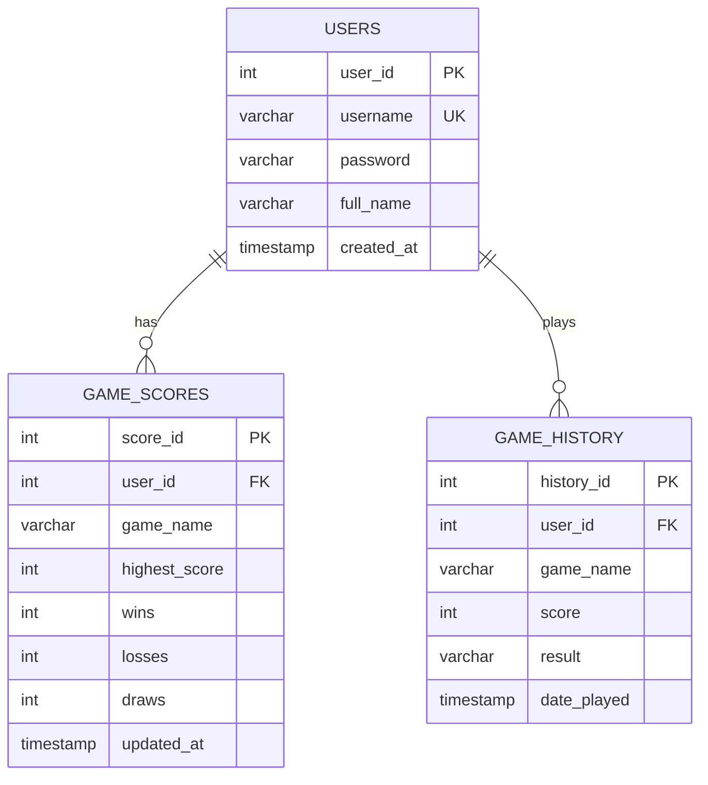

# ER Diagram

## Relationships

- One user can have many score records.
- One user can have many history records.
- `game_scores` keeps one summary row per user and game.
- `game_history` stores every completed play session.
